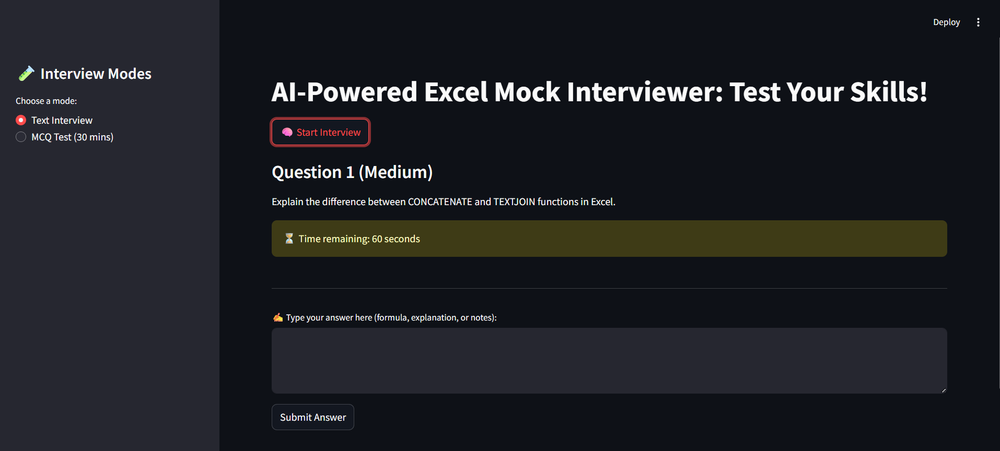
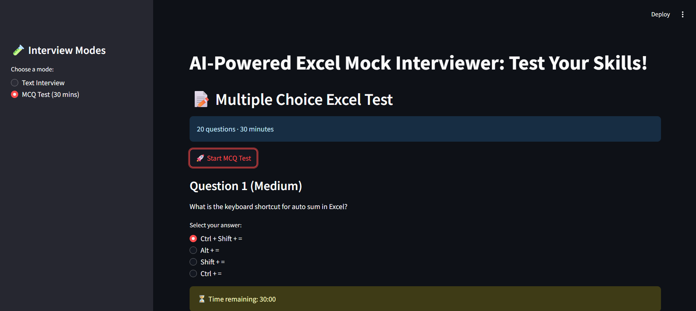
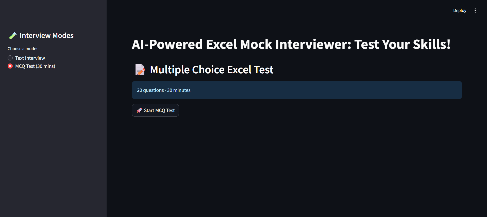

# 🧠 AI-Powered Excel Mock Interviewer

An intelligent AI-based Excel interview simulator for assessing candidate proficiency in **Finance**, **Operations**, and **Data Analytics** roles. Built with Streamlit, OpenAI GPT, and SQLite — fully local and cloud-free.

---

## 🚀 Features

- 🔍 **Two Interview Modes**:
  - **Text Interview** – 10 open-ended Excel questions with AI-generated feedback & scores
  - **MCQ Test** – 20 randomized Excel multiple-choice questions with 30-minute countdown timer

- 🧠 **AI-Powered Evaluation** (using OpenAI GPT-3.5 / GPT-4)
- 📄 **Downloadable Feedback Report** for text answers
- 🕒 **Timers** for both modes
- 💾 **SQLite** local storage (no cloud dependency)
- 🎨 **Professional black & white UI**

---

## 📸 Screenshots

| Text Interview Mode | MCQ Test Mode | Dashboard |
|---------------------|---------------|-----------|
|  |  |  |

---

## 🛠 Tech Stack

- **Frontend**: Streamlit (Python)
- **AI Model**: OpenAI GPT-4 / GPT-3.5
- **Database**: SQLite (via `sqlite3`)
- **Environment**: Python-dotenv for secure API keys

---

## 📂 Folder Structure

```
ExcelMock/
│
├── app.py                      # Main Streamlit App
├── requirements.txt            # Python dependencies
├── .env                        # OpenAI API key (not tracked)
├── README.md                   # Project documentation
│
├── services/
│   ├── question_generator.py   # Question generation logic
│   ├── evaluator.py           # Answer evaluation
│   └── feedback_generator.py   # Feedback creation
│
├── db/
│   └── database.py            # SQLite database operations
│
├── prompts/
│   ├── evaluation_prompt.py   # AI evaluation prompts
│   └── question_prompt.py     # Question generation prompts
│
├── session.py                 # Session management
└── screenshots/
    ├── ss1.png                # Application screenshot 1
    ├── ss2.png                # Application screenshot 2
    └── ss3.png                # Application screenshot 3
```

---

## ⚙️ Setup Instructions

### ✅ Prerequisites

- Python 3.7 or higher
- OpenAI API key
- Git (for cloning)

### 🛠 Installation

```bash
# 1. Clone the repository
https://github.com/your-username/ExcelMock.git
cd ExcelMock

# 2. Create and activate virtual environment
python -m venv venv

# On Windows:
venv\Scripts\activate

# On Mac/Linux:
source venv/bin/activate

# 3. Install dependencies
pip install -r requirements.txt

# 4. Create .env file and add your OpenAI API Key
echo "OPENAI_API_KEY=sk-your-api-key-here" > .env

# 5. Run the Streamlit app
streamlit run app.py
```

### 🔧 Configuration

1. **OpenAI API Key**: Sign up at [OpenAI](https://platform.openai.com/) and get your API key
2. **Environment Variables**: Create a `.env` file in the root directory:
   ```
   OPENAI_API_KEY=sk-your-actual-api-key-here
   ```

---

## 📋 Usage

1. **Launch the application**: Run `streamlit run app.py`
2. **Choose interview mode**:
   - **Text Interview**: Answer 10 open-ended questions about Excel
   - **MCQ Test**: Complete 20 multiple-choice questions within 30 minutes
3. **Get AI feedback**: Receive detailed evaluation and scoring
4. **Download report**: Save your performance report as PDF/text

---

## 🔒 Privacy & Security

- **100% Local**: All data stored locally in SQLite database
- **No Cloud Dependency**: Except for OpenAI API calls for evaluation
- **Secure API Usage**: Environment variables protect your OpenAI key
- **No Personal Data Collection**: Interview responses stored locally only

---

## 🤝 Contributing

1. Fork the repository
2. Create a feature branch (`git checkout -b feature/amazing-feature`)
3. Commit your changes (`git commit -m 'Add some amazing feature'`)
4. Push to the branch (`git push origin feature/amazing-feature`)
5. Open a Pull Request

---

## 🐛 Issues & Support

If you encounter any issues or have questions:

1. Check the [Issues](https://github.com/your-username/excel-mock-interviewer/issues) page
2. Create a new issue with detailed description
3. Include error messages and system information

---

## 🙏 Acknowledgments

- OpenAI for providing the GPT API
- Streamlit for the excellent web framework
- The open-source community for inspiration and tools